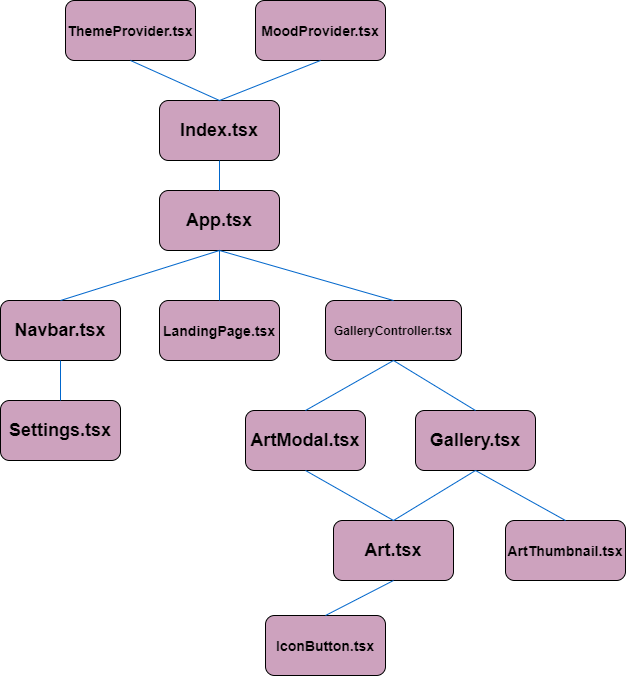

# Vector gallery

A small art-gallery SPA built with "plain" React and Typescript as a part of the course IT2810 Web development. The participants for the project were two others and I. The goals and learning objectives of the project were to learn the fundamental parts of React, as well as making a responsive web design. Some of the criteria of the project was to only use CSS3 and not to use any React component libraries. We were also supposed to demonstrate possible use cases for Web storage and React's Context API, as well as how to utilize external APIs.

To see a live demo, checkout [VektorGalleriet](https://vector-gallery.herokuapp.com)!

**Remark**
The app is partially in Norwegian.

# Manual setup

1. Clone repo
2. `$ cd <repo-folder>`
3. `$ npm i`
4. For Development: `$ npm start`
    - For production build: `$ npm run build`, then `$ npm run start`
5. Checkout `localhost:3000`

## Component hierarchy

_The diagram is a rough outline of the hierarchy. We have excluded the Router components from the diagram to highlight our components._

# Contributing

Before contributing to the project, make sure that

1. All tests are passed with `$ npm run test`
2. No linting errors, verified with `$ npm run lint`
3. No weirdly formated code, fixed with `$ npm run format`

# Credits

Icons from [Vitaly Gorbachev](https://www.flaticon.com/authors/vitaly-gorbachev) from [Flaticon](https://www.flaticon.com/) and [Mater Design](https://material.io/resources/icons/?style=baseline)

Some sounds from Zapsplat.com:

-   Weather (moody)
-   Weather (happy)
-   Tree swing (happy)

(snowman_moody): Undertow by Scott Buckley | https://soundcloud.com/scottbuckley\
Music promoted by https://www.free-stock-music.com\
Attribution 4.0 International (CC BY 4.0)
https://creativecommons.org/licenses/by/4.0/

(snowman_happy): Snowflakes by Vlad Gluschenko | https://soundcloud.com/vgl9\
Music promoted by https://www.free-stock-music.com\
Creative Commons Attribution 3.0 Unported License
https://creativecommons.org/licenses/by/3.0/deed.en_US
